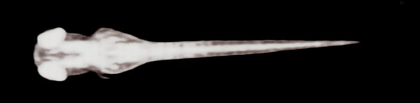

[](https://doi.org/10.5281/zenodo.15485459)
# ZebraFish-Diffusion-Model
Repository for the Zebrafish LDM Pipeline

This repository contains an implementation of Denoising Diffusion Probabilistic Models (DDPM). 
Its applications were used in the study:  Gene expansions contributing to human brain evolution by Daniela C Soto et al. (Cell, 2025)
- `/Data/` — Contains directories with images in `.tiff` format as well as associated coordinate `.json` files  
- `/Zebrafish-LDM/` — Contains the scripts necessary to run the diffusion model  
- `/models/` — Contains all saved model weights for the SAM, VAE, and LDM  
- `/VAE_results/` — Contains the saved embeddings after running the embed script  
- `/outputs/` — Contains the results of the Segment Anything preprocessing script  
  
Structure of model weights in Directories
```
.
├── Data/
│   └── ... (image .tiff files and associated .json files)
├── Zebrafish-LDM/
│   └── ... (diffusion model scripts)
├── models/
│   ├── sam_vit_h_4b8939.pth
│   ├── rvae_1_ckpt_angle1_48.pth
│   └── LDM_NOGUIDE_PTO_PERGEN_BESTMODEL/
│       └── ... (LDM model files)
├── VAE_results/
│   └── ... (saved embeddings)
├── outputs/
│   └── ... (Segment Anything preprocessing results)

```

Downloading Required Models:
```
Download SAM model weights  wget https://huggingface.co/HCMUE-Research/SAM-vit-h/resolve/main/sam_vit_h_4b8939.pth
Download LDM model weights  wget https://ucdavis.box.com/s/07k7brxsrjfj2h5fq2qv92mwusca02ss
```


Running Example Process:
```
conda env create -f ZebraFish_LDM.yaml
python Zebrafish_LDM/ZebraFish_Segment_Anything.py --DATA_PATH=./Data/ --META_PATH=./Zebrafish_LDM/example.xlsx --SAM_PATH=./models/sam_vit_h_4b8939.pth --OUT_PATH=./outputs
python Zebrafish_LDM/vae_embed.py --DATA_PATH=./outputs/Example_images.npy --META_PATH=./outputs/Example_metadata.csv --VAE_PATH=./VAE_results/ --MODEL_PATH=./models/
python Zebrafish_LDM/Zebrafish_Perturbation.py --run_name=LDM_NOGUIDE_PTO_PERGEN_BESTMODEL --noise_steps=350 --epochs=2000 --device='cuda' --CONVAE_PATH=./models/rvae_1_ckpt_angle1_48.pth --DATA_PATH=./VAE_results/model_ckpt/embedding_48_new.pt --OUT_PATH=.Zebrafish_LDM/LDM --META_PATH=./outputs/Example_metadata.csv --PERTURBATION_PLATE='3_2021.11.15_hydinKO'
```

Input Example:


Output Example:




Retraining VAE on new data:
```
python Zebrafish_LDM/ZebraFish_Segment_Anything.py --DATA_PATH=./Data/ --META_PATH=./Zebrafish_LDM/example.xlsx --SAM_PATH=./models/sam_vit_h_4b8939.pth --OUT_PATH=./outputs
python Zebrafish_LDM/vae_training.py --DATA_PATH=./outputs/Example_images.npy --META_PATH=./outputs/Example_metadata.csv --VAE_PATH=./VAE_results/
```

Retraining LDM on new data:
```
python Zebrafish_LDM/vae_embed.py --DATA_PATH=./outputs/Example_images.npy --META_PATH=./outputs/Example_metadata.csv --VAE_PATH=./VAE_results/ --MODEL_PATH=./models/
python Zebrafish_LDM/LDM_training.py --run_name=LDM_NOGUIDE_PTO_PERGEN_BESTMODEL --noise_steps=350 --epochs=2000 --device='cuda' --CONVAE_PATH=./models/rvae_1_ckpt_angle1_48.pth --DATA_PATH=./VAE_results/model_ckpt/embedding_48_new.pt --OUT_PATH=.Zebrafish_LDM/LDM --META_PATH=./outputs/Example_metadata.csv
```

